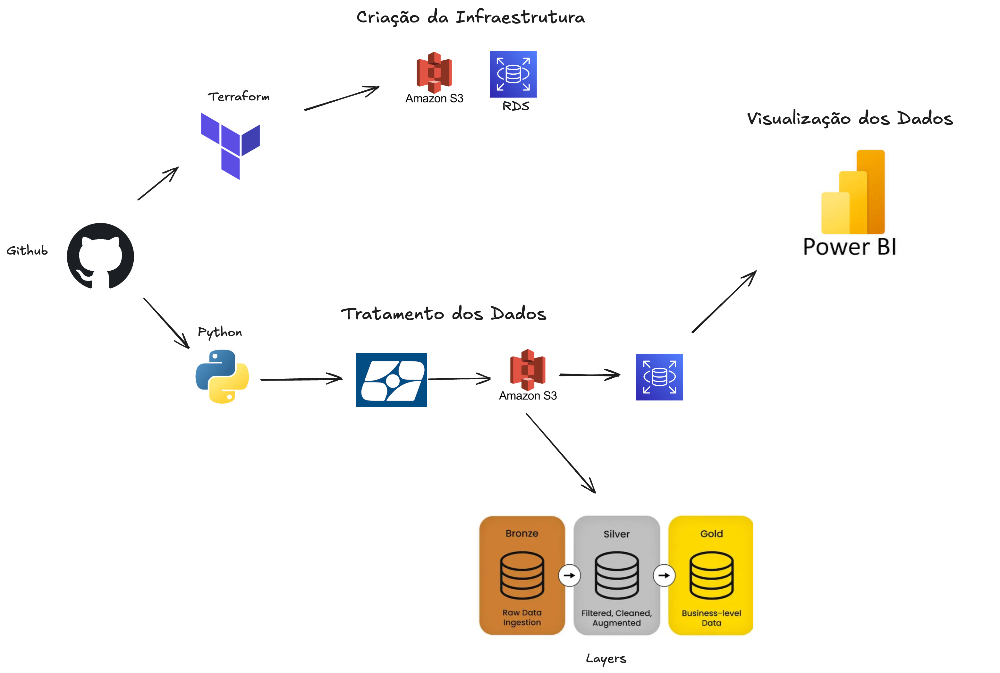

# Tech Challenge — Terraform + Python ETL (PNAD COVID)



End-to-end pipeline:

**GitHub (PNAD data)** → **S3 (bronze/silver/gold)** → **PostgreSQL (RDS)** → **Power BI**

- **Terraform** creates the AWS infra (S3, RDS, policies, etc.).
- **Python** ingests PNAD data, builds bronze/silver/gold layers in S3, and loads **gold** into **PostgreSQL**.

> ⚠️ Important: never commit secrets (.env, tfvars with passwords, state files).

---

## 1) Prerequisites

- **AWS account** with permissions for S3, RDS, IAM, VPC
- **AWS CLI** configured (`aws sts get-caller-identity` should work)
- **Terraform ≥ 1.5**
- **Python ≥ 3.10** (tested with 3.11/3.12/3.13)
- **Git**

---

## 2) Terraform (infra)

Repo structure (terraform):

```
terraform/
├── data.tf
├── main.tf
├── output.tf
├── s3.tf
├── variables.tf
└── versions.tf
```

### 2.1 Configure variables

Create `terraform/terraform.tfvars` (example):

```hcl
project              = "tech-challenge"
aws_region           = "sa-east-1"

# S3
s3_bucket            = "fiap-bigdata0110"   # must be globally unique
s3_versioning        = true
allowed_cidrs        = ["YOUR_PUBLIC_IP/32"]  # lock down access (optional)
allowed_vpce_ids     = []                      # e.g. ["vpce-xxxxxxxx"]

# RDS (if present in your *.tf)
db_name              = "pnad_covid"
db_username          = "postgres"
db_password          = "<strong-password-here>"
db_instance_class    = "db.t3.micro"
db_allocated_storage = 20
db_public_access     = true
```

> If your variable names differ, follow your `variables.tf`.  
> If the bucket already exists, either import it or choose another unique name.

### 2.2 Init / Plan / Apply

```bash
cd terraform
terraform init
terraform plan -out tf.plan
terraform apply tf.plan
```

Record the outputs:
- **S3 bucket name** (e.g., `fiap-bigdata0110`)
- **RDS endpoint** (e.g., `postgres-tc.xxxxx.sa-east-1.rds.amazonaws.com`)

### 2.3 Destroy (optional)

```bash
terraform destroy
```

---

## 3) Python ETL

Pipeline steps:
1. **Bronze**: downloads PNAD microdata (zips) → extracts CSVs → uploads to `s3://<bucket>/bronze/`
2. **Silver**: consolidates CSVs + enriches with **UF table (scraped from IBGE)** → `s3://<bucket>/silver/*.parquet`
3. **Gold**: selects curated columns (and filters last 3 values of `v1013`) → `s3://<bucket>/gold/*.parquet`
4. **DB Load**: TRUNCATE + COPY **gold** into **PostgreSQL** table `questionario_pnad_covid`

### 3.1 Create venv & install dependencies

```bash
cd python
python -m venv .venv
source .venv/bin/activate   # Windows: .venv\Scripts\activate
pip install -r requirements.txt
```

Your `requirements.txt` should include:

```
python-dotenv>=1.0
requests>=2.31
boto3>=1.34
pandas>=2.2
pyarrow>=16.0
s3fs>=2024.5.0
SQLAlchemy>=2.0
psycopg2-binary>=2.9
lxml>=4.9
certifi>=2024.2.2
```

### 3.2 Export environment variables

Use the values below (fill the secrets). You can also put these into a local `.env` and `source .env`.

```bash
# --- AWS ---
export AWS_ACCESS_KEY_ID=""
export AWS_SECRET_ACCESS_KEY=""
export AWS_REGION="sa-east-1"
# export AWS_SESSION_TOKEN=""   # only if using temporary creds

# --- PostgreSQL (RDS / PNAD) ---
export POSTGRES_USER_PNAD="postgres"
export POSTGRES_PASSWORD_PNAD=""
export POSTGRES_HOST_PNAD="postgres-tc.clieswmc6fw2.sa-east-1.rds.amazonaws.com"
export POSTGRES_PORT_PNAD="5432"
export POSTGRES_DB_PNAD="pnad_covid"

# --- S3 bucket (from terraform) ---
export S3_BUCKET="fiap-bigdata0110"

# Optional: force rebuild of silver/gold even if they already exist
# export OVERWRITE="true"
```

### 3.3 Run the pipeline

```bash
python main.py
```

Expected logs:
- Bronze: “Processando…” / uploads to `bronze/`
- Silver: “Consolidado: X linhas…” / saves parquet to `silver/`
- Gold: “Salvando Gold: s3://…/gold/…” / parquet saved
- DB: “TRUNCATE questionario_pnad_covid / COPY … linhas”

---

## 4) Power BI (optional)

Connect Power BI Desktop to your RDS:

1. **Get Data → PostgreSQL**  
   - Server: `postgres-tc.clieswmc6fw2.sa-east-1.rds.amazonaws.com`  
   - Database: `pnad_covid`  
   - Username: `postgres`  
   - Password: (what you set)
2. Choose table **`questionario_pnad_covid`**.
3. Build your visuals.

> If connecting from outside AWS, ensure the DB is **publicly accessible** and the SG allows your **public IP** on port **5432**.

---

## 5) Useful commands

**Check AWS identity**
```bash
aws sts get-caller-identity
```

**List S3 objects**
```bash
aws s3 ls s3://fiap-bigdata0110/ --recursive
```

**Test psql (optional)**
```bash
psql "host=postgres-tc.clieswmc6fw2.sa-east-1.rds.amazonaws.com port=5432 dbname=pnad_covid user=postgres password=*** sslmode=require"
```

---

## 6) Troubleshooting

- **Terraform AccessDenied (S3 policy / PublicAccessBlock)**  
  Make sure your IAM principal/account is allowed by your bucket policy/SCP and IP allowlist. If you used strict bucket policies, add your account to manage the bucket policy.

- **BucketAlreadyOwnedByYou**  
  The bucket already exists—either `terraform import` it or choose a new unique name.

- **RDS password invalid**  
  RDS rejects `/ @ " (space)`. Use printable ASCII (no forbidden chars).

- **Python merge error (int vs object on UF)**  
  We coerce both keys to strings before merging UF (handled in `silver.py`).

- **Invalid transaction / PendingRollback**  
  Loader uses **no-DROP schema** (`ensure_schema_no_drop`) and **TRUNCATE + COPY**. On error we rollback and dispose the engine.

- **TLS/cert errors when downloading**  
  Ensure `certifi` is installed; `requests` uses it by default.

---

## 7) .gitignore (recommended)

At repo root:

```
# Terraform
.terraform/
.terraform.*.lock.hcl
terraform.tfstate
terraform.tfstate.*
*.tfvars
*.tfvars.json

# Python
__pycache__/
*.py[cod]
.venv/
.env
*.csv

# macOS
.DS_Store
```

---

## 8) Project layout (reference)

```
.
├── terraform/
│   ├── data.tf
│   ├── main.tf
│   ├── output.tf
│   ├── s3.tf
│   ├── variables.tf
│   └── versions.tf
└── python/
    ├── main.py                 # Orchestrates bronze → silver → gold → DB
    ├── bronze.py               # Downloads PNAD → S3/bronze (idempotent)
    ├── silver.py               # Consolidate + UF enrich → S3/silver (idempotent)
    ├── gold.py                 # Curate columns → S3/gold (idempotent)
    ├── db_load.py              # ensure_schema_no_drop + TRUNCATE + COPY
    ├── uf_fetch.py             # Scrape IBGE UF table
    ├── aws_utils.py            # S3 helpers (s3_uri_exists, etc.)
    ├── s3_layout.py            # ensure_prefixes(bronze/silver/gold)
    ├── utils.py                # display, timers, misc
    └── requirements.txt
```
